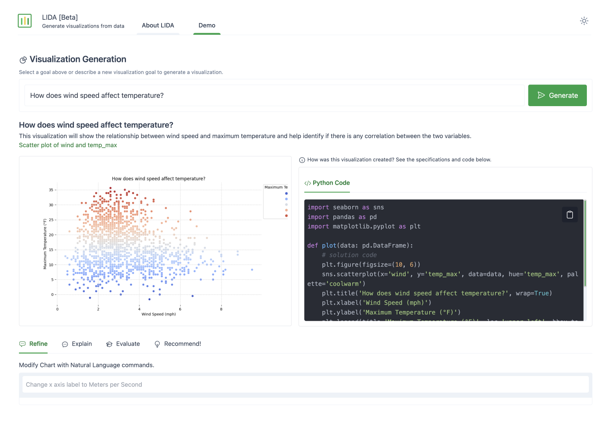
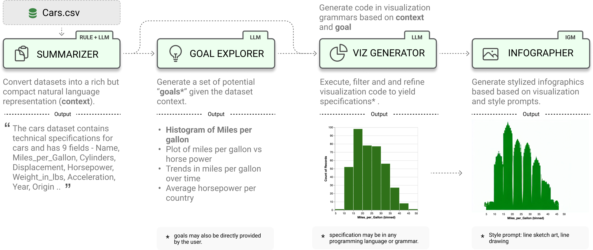

# LIDA: Automatic Generation of Visualizations and Infographics using Large Language Models

[](https://badge.fury.io/py/lida)
[](https://arxiv.org/abs/2303.02927)
<a target="_blank" href="https://colab.research.google.com/github/microsoft/lida/blob/main/notebooks/tutorial.ipynb">

</a>

<!--  -->

LIDA is a library for generating data visualizations and data-faithful infographics. LIDA is grammar agnostic (will work with any programming language and visualization libraries e.g. matplotlib, seaborn, altair, d3 etc) and works with multiple large language model providers (OpenAI, Azure OpenAI, PaLM, Cohere, Huggingface). Details on the components of LIDA are described in the [paper here](https://arxiv.org/abs/2303.02927) and in this tutorial [notebook](notebooks/tutorial.ipynb). See the project page [here](https://microsoft.github.io/lida/) for updates!.

> **Note on Code Execution:**
> To create visualizations, LIDA _generates_ and _executes_ code.
> Ensure that you run LIDA in a secure environment.

## Features



LIDA treats _**visualizations as code**_ and provides a clean api for generating, executing, editing, explaining, evaluating and repairing visualization code.

- [x] Data Summarization
- [x] Goal Generation
- [x] Visualization Generation
- [x] Visualization Editing
- [x] Visualization Explanation
- [x] Visualization Evaluation and Repair
- [x] Visualization Recommendation
- [x] Infographic Generation (beta) # pip install lida[infographics]

```python

from lida import Manager, llm

lida = Manager(text_gen = llm("openai")) # palm, cohere ..
summary = lida.summarize("data/cars.csv")
goals = lida.goals(summary, n=2) # exploratory data analysis
charts = lida.visualize(summary=summary, goal=goals[0]) # exploratory data analysis
```

## Getting Started

Setup and verify that your python environment is **`python 3.10`** or higher (preferably, use [Conda](https://docs.conda.io/en/main/miniconda.html#installing)). Install the library via pip.

```bash
pip install lida
```

Once requirements are met, setup your api key. Learn more about setting up keys for other LLM providers [here](https://github.com/victordibia/llmx).

```bash
export OPENAI_API_KEY=<your key>
```

Alternatively you can install the library in dev model by cloning this repo and running `pip install -e .` in the repository root.

## Web API and UI

LIDA comes with an optional bundled ui and web api that you can explore by running the following command:

```bash
lida ui  --port=8080 --docs
```

Then navigate to http://localhost:8080/ in your browser. To view the web api specification, add the `--docs` option to the cli command, and navigate to `http://localhost:8080/api/docs` in your browser.

The fastest and recommended way to get started after installation will be to try out the web ui above or run the [tutorial notebook](notebooks/tutorial.ipynb).

### Data Summarization

Given a dataset, generate a compact summary of the data.

```python
from lida import Manager

lida = Manager()
summary = lida.summarize("data/cars.json") # generate data summary
```

### Goal Generation

Generate a set of visualization goals given a data summary.

```python
goals = lida.goals(summary, n=5, persona="ceo with aerodynamics background") # generate goals
```

Add a `persona` parameter to generate goals based on that persona.

### Visualization Generation

Generate, refine, execute and filter visualization code given a data summary and visualization goal. Note that LIDA represents **visualizations as code**.

```python
# generate charts (generate and execute visualization code)
charts = lida.visualize(summary=summary, goal=goals[0], library="matplotlib") # seaborn, ggplot ..
```

### Visualization Editing

Given a visualization, edit the visualization using natural language.

```python
# modify chart using natural language
instructions = ["convert this to a bar chart", "change the color to red", "change y axes label to Fuel Efficiency", "translate the title to french"]
edited_charts = lida.edit(code=code,  summary=summary, instructions=instructions, library=library, textgen_config=textgen_config)

```

### Visualization Explanation

Given a visualization, generate a natural language explanation of the visualization code (accessibility, data transformations applied, visualization code)

```python
# generate explanation for chart
explanation = lida.explain(code=charts[0].code, summary=summary)
```

### Visualization Evaluation and Repair

Given a visualization, evaluate to find repair instructions (which may be human authored, or generated), repair the visualization.

```python
evaluations = lida.evaluate(code=code,  goal=goals[i], library=library)
```

### Visualization Recommendation

Given a dataset, generate a set of recommended visualizations.

```python
recommendations = lida.recommend(code=code, summary=summary, n=2,  textgen_config=textgen_config)
```

### Infographic Generation [WIP]

Given a visualization, generate a data-faithful infographic. This methods should be considered experimental, and uses stable diffusion models from the [peacasso](https://github.com/victordibia/peacasso) library. You will need to run `pip install lida[infographics]` to install the required dependencies.

```python
infographics = lida.infographics(visualization = charts[0].raster, n=3, style_prompt="line art")
```

## Important Notes / Caveats / FAQs

- LIDA generates and executes code based on provided input. Ensure that you run LIDA in a secure environment with appropriate permissions.
- LIDA currently works best with datasets that have a small number of columns (<= 10). This is mainly due to the limited context size for most models. For larger datasets, consider preprocessing your dataset to use a subset of the columns.
- LIDA assumes the dataset exists and is in a format that can be loaded into a pandas dataframe. For example, a csv file, or a json file with a list of objects. In practices the right dataset may need to be curated and preprocessed to ensure that it is suitable for the task at hand.
- Smaller LLMs (e.g., OSS LLMs on Huggingface) have limited instruction following capabilities and may not work well with LIDA. LIDA works best with larger LLMs (e.g., OpenAI GPT 3.5, GPT 4).
- How reliable is the LIDA approach? The LIDA [paper](https://aclanthology.org/2023.acl-demo.11/) describes experiments that evaluate the reliability of LIDA using a visualization error rate metric. With the current version of prompts, data summarization techniques, preprocessing/postprocessing logic and LLMs, LIDA has an error rate of < 3.5% on over 2200 visualizations generated (compared to a baseline of over 10% error rate). This area is work in progress.

Naturally, some of these limitations could be addressed by a much welcomed PR.

## Documentation and Citation

A short paper describing LIDA (Accepted at ACL 2023 Conference) is available [here](https://arxiv.org/abs/2303.02927).

```bibtex
@inproceedings{dibia2023lida,
    title = "{LIDA}: A Tool for Automatic Generation of Grammar-Agnostic Visualizations and Infographics using Large Language Models",
    author = "Dibia, Victor",
    booktitle = "Proceedings of the 61st Annual Meeting of the Association for Computational Linguistics (Volume 3: System Demonstrations)",
    month = jul,
    year = "2023",
    address = "Toronto, Canada",
    publisher = "Association for Computational Linguistics",
    url = "https://aclanthology.org/2023.acl-demo.11",
    doi = "10.18653/v1/2023.acl-demo.11",
    pages = "113--126",
}
```

LIDA builds on insights in automatic generation of visualizaiton from an earlier paper - [Data2Vis: Automatic Generation of Data Visualizations Using Sequence to Sequence Recurrent Neural Networks](https://arxiv.org/abs/1804.03126).
